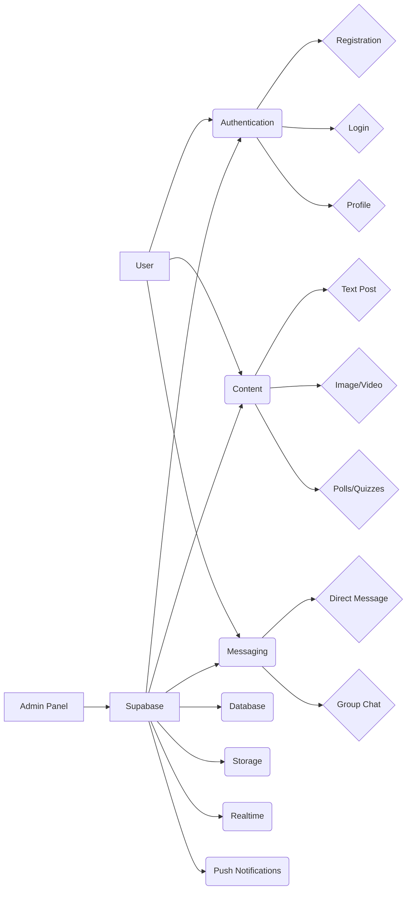

# Project Plan: Single-Community Amino App Clone

## 1. Project Overview

*   **Goal**: Develop a simplified version of the Amino app, focusing on a single shared community where users can engage, share content, and communicate. The chatrooms will be organized by regions and provinces in the Philippines.
*   **Target Audience**: Users interested in connecting with others based on their region and province in the Philippines.
*   **Design**: Maintain a clean, intuitive interface similar to Amino's look and feel, with a focus on easy navigation between regions and provinces. Prioritize the main feed and chatroom UI.
*   **Platforms**: iOS and Android using React Native and Expo. Target the latest versions of both operating systems.

## 2. Core Features

*   **User Authentication**:
    *   Registration
    *   Login
    *   Profile Management (edit profile, change password, etc.)
*   **Content Creation and Sharing**:
    *   Text posts
    *   Image uploads
    *   Video uploads
    *   Polls
    *   Quizzes
*   **Direct Messaging**:
    *   One-on-one chat
    *   Group chat
        *   Creation of group chats (provinces) is not allowed, they are pre-defined
        *   Adding/removing members is not applicable
        *   Group chat settings (name, description, etc.) are pre-defined
    *   Message features
        *   Text formatting (bold, italics, underline)
        *   Emojis
        *   Image/video attachments
        *   Link previews
        *   Message reactions (likes, etc.)
        *   Message deletion
        *   Message editing
    *   Chatroom features
        *   Real-time messaging
        *   Typing indicators
        *   Read receipts
        *   Push notifications for new messages
        *   Message search
        *   Mute/unmute users
        *   Report users
*   **Push Notifications**:
    *   New messages
    *   Mentions
    *   Replies to posts
*   **Search Functionality**:
    *   Search for users
    *   Search for posts
*   **Activity Feeds**:
    *   Display recent activities (e.g., new posts, comments, likes)
*   **Moderation System**:
    *   Reporting tools
    *   Admin panel for managing users and content
    *   Admin actions: Banning users and deleting posts

## 3. Technical Architecture

*   **Front-end**:
    *   **Framework**: React Native with Expo (cross-platform development)
    *   **State Management**: Redux or Context API
    *   **Navigation**: React Navigation
    *   **UI Components**: Use libraries like `react-native-paper` or `native-base`
*   **Back-end**:
    *   **Supabase as Backend**:
        *   **Authentication**: Supabase Auth for user registration, login, and profile management.
        *   **Database**: PostgreSQL (managed by Supabase) for storing users, posts, messages, and activity data.
        *   **Storage**: Supabase Storage for image/video uploads.
        *   **Real-time Communication**: Supabase Realtime for activity feeds and notifications.
*   **Cloud Services**:
    *   **Push Notifications**: Expo Push Notifications or Firebase Cloud Messaging (FCM)
    *   **Image/Video Storage**: Supabase Storage with optional CDN integration (e.g., CloudFront)

## 4. Development Process

*   **Phase 1: Project Setup and User Authentication**
    1.  **Set up Supabase**:
        *   Create a Supabase project and configure the database schema.
        *   Enable Supabase Auth for email/password and social logins.
    2.  **Integrate Supabase SDK in React Native**:
        *   Install `@supabase/supabase-js` and initialize it in your app.
    3.  **Implement Authentication Features**:
        *   Registration, login, and profile management.
*   **Phase 2: Content Creation and Sharing**
    1.  **Database Schema Design**:
        *   Define tables for `users`, `posts`, `comments`, and `polls`.
        *   Add relationships (e.g., a user has many posts, and a post has many comments).
    2.  **Implement Content Features**:
        *   Allow users to create text posts, upload images/videos, and create polls/quizzes.
        *   Use Supabase Storage for media uploads.
*   **Phase 3: Direct Messaging and Chatrooms**
    1.  **Database Schema**:
        *   Update the `group_chats` table to represent provinces.
        *   Add a `region_id` column to the `group_chats` table to represent the region.
        *   Pre-populate the `group_chats` table with the regions and provinces of the Philippines.
        *   The `messages` table will still be used for storing messages within each province (chatroom).
    2.  **Real-time Messaging**:
        *   Use Supabase Realtime to enable live updates for messages within each province (chatroom).
        *   Implement typing indicators using Supabase Realtime.
        *   Implement read receipts by updating a `read_at` column in the `messages` table.
    3.  **Push Notifications**:
        *   Integrate Expo Push Notifications or FCM for message notifications.
        *   Send push notifications when a user receives a new message in a province (chatroom) they are a member of.
*   **Phase 4: Search and Activity Feeds**
    1.  **Search Functionality**:
        *   Use Supabase's full-text search (`pg_search`) for searching users and posts.
        *   Implement message search within chatrooms.
    2.  **Activity Feed**:
        *   Use Supabase Realtime to listen for changes in the `posts` and `comments` tables.
        *   Display recent activities in a feed.
*   **Phase 5: Moderation System and Testing**
    1.  **Reporting Tools**:
        *   Create a `reports` table to track flagged content.
        *   Build an admin panel to review and manage reports.
        *   Implement user muting/unmuting functionality.
        *   Implement admin actions: Banning users and deleting posts.
    2.  **Testing**:
        *   Test all features thoroughly, focusing on edge cases (e.g., large file uploads, poor network conditions).
*   **Phase 6: Deployment**
    1.  **Deploy to App Stores**:
        *   Use Expo's EAS Build to generate production builds for iOS and Android.
        *   Publish the app to the Apple App Store and Google Play Store.
    2.  **Post-Deployment Monitoring**:
        *   Use tools like Sentry or Datadog to monitor app performance and errors.

## 5. Database Schema

*   **Users Table**
    *   `id` (UUID, primary key)
    *   `email` (text, unique)
    *   `username` (text, unique)
    *   `password` (text)
    *   `profile_picture` (text, URL to Supabase Storage)
    *   `bio` (text)
    *   `created_at` (timestamp)
    *   `updated_at` (timestamp)
*   **Posts Table**
    *   `id` (UUID, primary key)
    *   `user_id` (UUID, foreign key referencing Users table)
    *   `content` (text)
    *   `image_url` (text, URL to Supabase Storage)
    *   `video_url` (text, URL to Supabase Storage)
    *   `created_at` (timestamp)
    *   `updated_at` (timestamp)
*   **Comments Table**
    *   `id` (UUID, primary key)
    *   `post_id` (UUID, foreign key referencing Posts table)
    *   `user_id` (UUID, foreign key referencing Users table)
    *   `content` (text)
    *   `created_at` (timestamp)
    *   `updated_at` (timestamp)
*   **Polls Table**
    *   `id` (UUID, primary key)
    *   `post_id` (UUID, foreign key referencing Posts table)
    *   `question` (text)
    *   `created_at` (timestamp)
    *   `updated_at` (timestamp)
*   **Poll Options Table**
    *   `id` (UUID, primary key)
    *   `poll_id` (UUID, foreign key referencing Polls table)
    *   `option_text` (text)
    *   `vote_count` (integer)
*   **Messages Table**
    *   `id` (UUID, primary key)
    *   `sender_id` (UUID, foreign key referencing Users table)
    *   `group_id` (UUID, foreign key referencing Group Chats table)
    *   `content` (text)
    *   `created_at` (timestamp)
    *   `updated_at` (timestamp)
    *   `read_at` (timestamp, nullable)
*   **Group Chats Table**
    *   `id` (UUID, primary key)
    *   `region_id` (UUID, foreign key referencing Regions table)
    *   `name` (text, province name)
    *   `description` (text, province description)
    *   `created_at` (timestamp)
    *   `updated_at` (timestamp)
*   **Regions Table**
    *   `id` (UUID, primary key)
    *   `name` (text, region name)
    *   `description` (text, region description)
    *   `created_at` (timestamp)
    *   `updated_at` (timestamp)
*   **Group Members Table**
    *   `id` (UUID, primary key)
    *   `group_id` (UUID, foreign key referencing Group Chats table)
    *   `user_id` (UUID, foreign key referencing Users table)
    *   `joined_at` (timestamp)
*   **Reports Table**
    *   `id` (UUID, primary key)
    *   `reporter_id` (UUID, foreign key referencing Users table)
    *   `reported_id` (UUID, foreign key referencing Users table or Posts table or Comments table)
    *   `report_type` (text, e.g., "user", "post", "comment")
    *   `reason` (text)
    *   `created_at` (timestamp)
    *   `resolved` (boolean, default false)
    *   `resolved_at` (timestamp, nullable)

## 6. UI/UX Design

*   **Color Scheme**: Use a color scheme similar to the original Amino app, with a focus on blues and purples.
    *   Primary color: #4A90E2 (#62B1F6)
    *   Secondary color: #9013FE (#B162F6)
        *   Actions: Follow/unfollow, message, report
    *   Content Creation Screen: Provide a simple and intuitive interface for creating text posts, uploading images/videos, and creating polls/quizzes.
        *   Editor: Rich text editor with formatting options
        *   Media: Image/video upload preview
        *   Poll: Option to add poll options
    *   Direct Messaging Screen: Display a list of recent conversations and allow users to send and receive messages in real-time.
        *   List: Display conversations with last message and timestamp
        *   Chat: Display messages with sender and timestamp
        *   Input: Text input for sending messages
    *   Search Screen: Allow users to search for users and posts.
        *   Input: Search bar with suggestions
        *   Results: Display search results with relevant information
*   **Component Design**: Create reusable UI components that are consistent with the overall design.
    *   Button: Use a consistent style for buttons throughout the app.
        *   Style: Rounded corners, consistent color
        *   Size: Small, medium, large
        *   States: Normal, pressed, disabled
    *   Input: Use a consistent style for input fields throughout the app.
        *   Style: Underline or box
        *   Type: Text, password, email
        *   States: Normal, focused, error
    *   Card: Use a consistent style for displaying content in cards.
        *   Style: Rounded corners, shadow
        *   Content: Title, description, image/video
        *   Actions: Like, comment, share
    *   Avatar: Use a consistent style for displaying user avatars.
        *   Shape: Circle or square
        *   Size: Small, medium, large
        *   Border: Optional border
*   **Navigation**: Implement a clear and intuitive navigation system.
    *   Use a bottom tab navigator for main sections of the app (e.g., Home, Content, Messaging, Search, Profile).
        *   Icons: Use clear and recognizable icons
        *   Labels: Use short and descriptive labels
        *   Style: Consistent style with the overall design
    *   Use stack navigators for navigating within each section.
        *   Transitions: Use smooth and consistent transitions
        *   Header: Display relevant information and actions
*   **Accessibility**: Ensure that the app is accessible to users with disabilities.
    *   Provide alternative text for images.
    *   Use sufficient color contrast (WCAG 2.0 AA compliance).
    *   Support keyboard navigation.
    *   Use semantic HTML elements.
    *   Provide clear and concise labels for form elements.
    *   Allow users to adjust font sizes.
*   **Animations and Transitions**: Use subtle animations and transitions to enhance the user experience.
    *   Loading: Use loading indicators to show progress
    *   Transitions: Use smooth transitions between screens
    *   Feedback: Use animations to provide feedback on user actions

## 7. Gamification and User Retention Strategies

*   **Points and Badges**: Award points and badges for completing certain actions, such as creating posts, commenting, and liking content.
*   **Leaderboards**: Display leaderboards to show the top users in the community.
*   **Daily Streaks**: Encourage users to visit the app daily by awarding points for daily streaks.
*   **Challenges and Quests**: Create challenges and quests that users can complete to earn rewards.

## 8. Monetization Strategy

*   **In-App Purchases**: Offer in-app purchases for premium features, such as removing ads or unlocking exclusive content.
*   **Subscriptions**: Offer subscriptions for access to premium content or features.
*   **Advertising**: Display non-intrusive ads within the app.

## 9. Accessibility Considerations

*   **Screen Reader Compatibility**: Ensure that the app is compatible with screen readers for visually impaired users.
*   **Keyboard Navigation**: Provide keyboard navigation for users who cannot use a mouse or touchscreen.
*   **Color Contrast**: Use sufficient color contrast to ensure that text is readable for users with low vision.
*   **Font Size**: Allow users to adjust the font size to their preference.

## 10. Detailed Testing Plan

*   **Unit Tests**: Write unit tests for individual components and functions.
*   **Integration Tests**: Write integration tests to ensure that different parts of the app work together correctly.
*   **UI Tests**: Write UI tests to verify the user interface and user experience.
*   **User Acceptance Testing (UAT)**: Conduct UAT with a group of target users to gather feedback and identify any issues.

## 11. Analytics and Monitoring

*   **Track Key Metrics**: Track key metrics such as user engagement, retention, and monetization.
*   **Monitor App Performance**: Monitor app performance using tools like Sentry or Datadog.
*   **Analyze User Behavior**: Analyze user behavior to identify areas for improvement.

## 12. Onboarding Process

*   **Welcome Screen**: Display a welcome screen to introduce new users to the app.
*   **Tutorials**: Provide tutorials to guide new users through the key features of the app.
*   **Profile Setup**: Encourage new users to set up their profile by providing incentives.

## 13. Mermaid Diagram

## 14. Timeline

| Phase                                   | Duration (Weeks) |
|-----------------------------------------|------------------|
| Phase 1: Project Setup and Authentication | 2                |
| Phase 2: Content Creation and Sharing   | 3                |
| Phase 3: Direct Messaging               | 4                |
| Phase 4: Search and Activity Feeds      | 2                |
| Phase 5: Moderation System and Testing  | 3                |
| Phase 6: Deployment                     | 2                |

**Total Timeline:** ~16 weeks

## 15. Risks and Mitigation Strategies

### Scalability
- **Risk:** High traffic may strain the backend.
- **Mitigation:** Use Supabase's scalable infrastructure and optimize database queries.

### Security
- **Risk:** Unauthorized access to sensitive data.
- **Mitigation:** Implement Row-Level Security (RLS) in Supabase and encrypt sensitive data.

### Performance
- **Risk:** Slow load times for media-heavy content.
- **Mitigation:** Use a CDN for image/video delivery and lazy-load content.

### Cross-platform Compatibility
- **Risk:** UI inconsistencies between iOS and Android.
- **Mitigation:** Thoroughly test on both platforms and use responsive design principles.

## 16. Key Differences from Multi-Community App

1. **Simplified Database Schema:**
   - No need for separate `communities` or `categories` tables.
   - All posts, comments, and activities belong to the single community.

2. **Streamlined Moderation:**
   - Moderation tools are focused on managing content and users.
   - Admin roles and permissions are simpler since there's no hierarchy of communities.

3. **Reduced Complexity in Navigation:**
   - The app's UI can focus on core features without needing a community selection screen or category filters.

## 17. Advantages of a Single-Community App

1. **Faster Development:**
   - Fewer features to implement, reducing development time.
2. **Easier Moderation:**
   - Centralized moderation makes it easier to manage content and users.
3. **Stronger Community Focus:**
   - A single shared space fosters deeper engagement and interaction among users.

## 18. Potential Challenges

1. **Scalability:**
   - As the user base grows, ensure the app can handle high traffic and large volumes of posts/messages.
2. **User Retention:**
   - Without multiple communities, users may lose interest over time. Consider gamification or rewards to keep them engaged. 